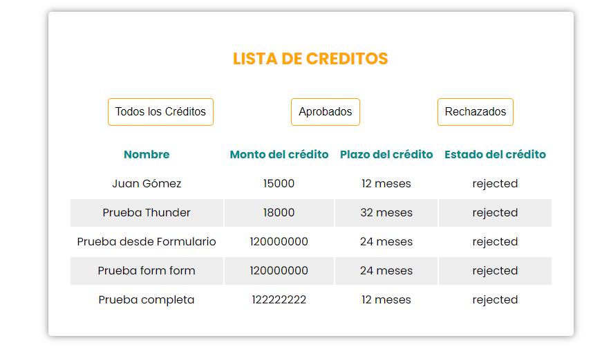

# Sistema de simulación de créditos

### Descripción
Este proyecto es una prueba técnica que implementa una aplicación full-stack. El frontend, desarrollado con React, proporciona una interfaz de usuario intuitiva, mientras que el backend, construido con Node.js y TypeScript, maneja la lógica del negocio y las bases de datos. Se han utilizado Jest y supertest para garantizar la calidad del código a través de pruebas unitarias e integradas.

### Tecnologías Utilizadas
* **Frontend:** React
* **Backend:** Node.js, TypeScript, Express
* **Base de datos:** SQL, MongoDB y Mongoose ORM
* **Pruebas:** Jest, supertest

### Instalación y Ejecución
#### Requisitos previos
* Node.js y npm (o yarn) instalados.

#### Clonar el repositorio
```bash
git clone https://github.com/juan-pablogomez/sistema-credito.git
```

#### Instalar dependencias
```bash
cd sistema-creditos
npm install
```

#### Configurar variables de entorno
Crea un archivo .env en la raíz de la carpeta "backend" y define tus variables de entorno. Por ejemplo:
``` js
PORT = 4000 
DB_NAME = sistema_creditos
DB_USER = root
DB_HOST = localhost
```

* Debe crear la base de datos "sistema_creditos" (en este caso) en su gestor de base de datos de preferencia.
* La aplicación se encargará de crear las tablas una vez inicializada su ejecución.

#### Ejecutar la aplicación completa desde el directorio raiz (sistema-credito)
``` bash
npm start
```
Este script de npm permitirá inicializar los proyectos de la carpeta "client" y de la carpeta "backend" al mismo tiempo

#### Ejecutar el servidor de desarrollo del Backend
Si desea ejecutar solo el proyecto del backend, debe entrar a la carpeta y ejecutar el comando
``` bash
cd backend
npm run dev
```
Podrá ejecutar las rutas y operaciones de la API desde http://localhost:[PORT]/api/credits, habiendo ya configurado la variable de entorno PORT en el archivo .env de la raiz del proyecto de la carpeta backend.

#### Ejecutar el servidor de desarollo del Frontend
Si por el contrario solo desea ejecutar solo el proyecto del frontend, debe entrar a la carpeta y ejecutar el comando
``` bash
cd client
npm run dev
```
Esta operación indicará que se ha inicializado la ejecución del proyecto de React con Vite y se podra visualizar en http://localhost:5173, puerto por defeto para aplicaciones de Vite.


#### Ejecutar pruebas
Desde el directorio raíz, o desde el directorio "backend" puede ejecutar las pruebas del archivo "./src/test/routes.spec.ts"
``` bash
npm run test
```

#### A tener en cuenta
* Se utilizan Hooks de React para el filtrado de creditos 'Aprobados' o 'Rechazados', evitando así la re-renderización de componenentes o peticiones HTTP adicionales para el filtrado de creditos por estado.
* Se crea CSS básico/necesario para las vistas de la tabla y el formulario




#### Compilación de Frontend
Para la generación de archivos estáticos del frontend para producción, se debe correr el siguiente comando
``` bash
cd client
npm run build
```

